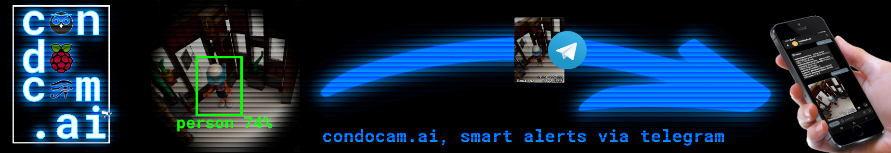
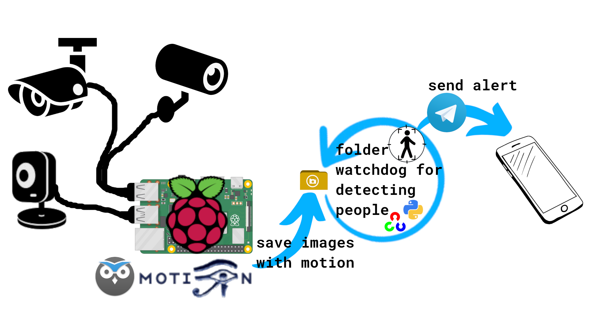

[](https://github.com/beep-projects/condocam.ai/blob/main/LICENSE) [](https://github.com/beep-projects/condocam.ai/actions/workflows/shellcheck.yml) [](https://github.com/beep-projects/condocam.ai/actions/workflows/pylint.yml) [](https://github.com/beep-projects/SystaPi/issues) [](https://github.com/beep-projects/condocam.ai/network) [](https://github.com/beep-projects/condocam.ai/stargazers) 

# condocam.ai

condocam.ai converts a Raspberry Pi + webcams into a **smart surveillance camera** with **people detection** and **automated alerts via Telegram**. The usage of people detection prevents false alarms caused by cats, dogs, light changes, etc. . (If you want, you can also make it detect cats)

This project is based on the work from following other projects:

- [Motion](https://github.com/Motion-Project/motion) for simple motion detection, based on changed pixel between images
- [motionEye](https://github.com/ccrisan/motioneye) for simplified configutation of [Motion](https://github.com/Motion-Project/motion) and the attached cameras via a web interface
- [RaspAP](https://raspap.com/) for setting up a mobile hot spot on the **condocam.ai** (only set this up if you know how to secure a Raspberry Pi!)
- [OpenCV](https://opencv.org/) with a trained [MobileNetSSD](https://github.com/nikmart/pi-object-detection) model for [people detection](https://www.pyimagesearch.com/2017/10/16/raspberry-pi-deep-learning-object-detection-with-opencv/)
- [telegram-notify](http://www.bernaerts-nicolas.fr/linux/75-debian/351-debian-send-telegram-notification) for sending messages via [Telegram](https://telegram.org/apps)

## Content

- [System Overview](#system-overview)
- [Project Requirements](#project-requirements)
- [Directory Structure](#directory-structure)
- [Installation](#installation)
  - [Setup a Telegram bot](#setup-a-telegram-bot)
  - [Installation on Linux](#installation-on-linux)
  - [Installation on Windows](#installation-on-windows)
- [Bot Commands](#bot-commands)

## <a name="system-overview"/>System Overview



## <a name="project-requirements"/>Project Requirements

The project is designed to run on any Raspberry Pi available. The people detection part requires the most CPU power, so if you use earlier models, you will experience a bigger lag for the alerts via telegram. The following describes the setup that I use with good results:

**Setup #1 "Surveillance Camera for my home"**
This setup features three cameras that overlook the important areas that intruders might pass on their way into my home.

- Raspberry Pi 4 Model B
- 64 GByte SD card
- 3 USB cameras:
  - GEMBIRD, UVC 1.00 device USB2.0 PC CAMERA (1908:2311)
  - Spedal C920 Pro Full HD webcam, UVC 1.00 device USB  Live camera (0c45:636b)
  - Logitech C525, UVC 1.00 device HD Webcam C525 (046d:0826)

**Setup #2 "Surveillance Camera for vacation homes"**
I use this setup for small mobile homes. One camera is enough to overlook the door. condocam.ai requires an internet connection for sending the telegram alerts, so I have added a LTE stick to it and added RaspAP as hot spot software to provide internet access for the whole family.

- Raspbery Pi 3 Model B+
- 32 GByte SD card
- Huawei Technologies Co., Ltd. E3372 LTE/UMTS/GSM HiLink Modem/Networkcard (12d1:14dc)
- 1 USB camera:
  - Chicony Electronics Co., Ltd HP Wide Vision HD Camera (04f2:b6b6)
  
**Note:** although the image detection should run on any Raspberry Pi model, you should go for a Raspberry Pi 4. The performance will vary heavily, as my quick and dirty measurements show for images of size 320x240 pixels.

| Model                           | typical processing time |
| ------------------------------- | ----------------------- |
| Raspberry Pi Model B+ v1.2      | 25-40s, avg. 29s        |
| Raspberry Pi 3 Model B+ Rev 1.3 | 1.6-3.1s, avg. 2.5s     |
| Raspberry Pi 4 Model B Rev 1.2  | 0.4-1.3s, avg. 0.58s    |


## <a name="directory-structure"/>Directory Structure

````
## Directory Structure of this Project

```
    ├── condocam-pi             # this folder holds all files that will be copied over to the Raspberry Pi
    │   ├── files               # all files which are required to run condocam.ai. These are all the configuration files
    │   │                       # for Motion and motionEye, as well as the files for the people detection and the communication
    │   │                       # via telegram
    │   ├── cmdline.txt         # file to be placed under /boot/cmdline.txt on the pi. Triggers the execution of firstrun.sh
    │   ├── firstrun.sh         # script for configuring Telegram bot, WiFi, keyboard and timezone. 
    │   │                       # You have to configure a few things in here!
    │   ├── secondrun.sh        # called by firstrun.sh after a reboot. Should have network running. 
    │   │                       # Does a full-upgrade of the system, sets up the communication via Telegram and
    │   │                       # installs required packages and services
    │   └── thirdrun.sh         # Cleans up after the installation and reboots into the final system
    ├── doc                     # documentation for this project
    │   └── ressources          # ressource files like images, used for the documentation of this project
    ├── install_condocam.ai.sh  # Script for automatically downloading, flashing and configuring 
    │                           # a Micro SD card for running condocam.ai
    ├── LICENSE                 # License for using and editing this software
    └── readme.md               # This file
```
````

## <a name="installation"/>Installation

If everything works fine, you can set up your **contocam.ai** in less than 1 hour. Main part is the automated installation of all required packages on the Raspberry Pi which runs for ~45 minutes.

#### <a name="setup-a-telegram-bot"/>Setup a Telegram bot

In order to use the messaging feature, you need a **Telegram** account and app. See [telegram.org](https://telegram.org/) on how to set this up.  
Once you have telegram installed, you need to create a **bot** for communication with your **condocam.ai** installation. This can be done by talking to **[@BotFather](https://core.telegram.org/bots#6-botfather)** in your telegram app. [Follow this guide](https://core.telegram.org/bots#6-botfather), or google for it.
Once you have obtained a **token** to authorize your bot, you can start the installation. The **token** is a string like ```110201543:AAHdqTcvCH1vGWJxfSeofSAs0K5PALDsaw``` that is required to authorize the bot and send requests to the Bot API. condocam.ai will use this **token** to send messages to you.  
After setting up the **Telegram bot**, send any message to your bot. 
**Note:** If you do not continue with the installation within the next 24h you have to send a message to your bot again!  
**condocam.ai** will use that message to set you as  administrator. You can change the configured administrator later by editing ```/etc/condocam/condocambotbot.conf``` on the device, but that is some effort you can avoid by using the admin device/account for setting all up

#### <a name="installation-on-linux"/>Installation on Linux

For Linux I provide a script that downloads Raspberry Pi OS and flashes it onto a Micro SD card. The script was mainly written out of curiosity to see how that could work. So it has no added sanity checks and you should use it with care. Check each step, when asked to confirm. If unsure, follow the manual installation guide.

1. Run the following commands in a shell for downloading and unzipping the project files

   ```bash
   wget https://github.com/beep-projects/condocam.ai/archive/refs/heads/main.zip
   unzip main.zip
   ```
2. Open `condocam.ai-main/condocam-pi/firstrun.sh` with a text editor and configure everything in the marked section to your liking.  
   Set the ```BOT_TOKEN``` to the **token** of your bot from the preparation  
   You also might want to generate your `WPA_PASSPHRASE` via `wpa_passphrase MY_WIFI passphrase` , or  use the [WPA PSK (Raw Key) Generator](https://www.wireshark.org/tools/wpa-psk.html), and add the credentials to the file.

   ```bash
   #-------------------------------------------------------------------------------
   #----------------------- START OF CONFIGURATION --------------------------------
   #-------------------------------------------------------------------------------
   
   # which hostname do you want to give your raspberry pi?
   HOSTNAME=condocam
   BOT_TOKEN=COPY_BOT_TOKEN_HERE
   # configure the wifi connection
   # the example WPA_PASSPHRASE is generated via
   #     wpa_passphrase MY_WIFI passphrase
   # but you also can enter your passphrase as plain text, if you accept the potential insecurity of that approach
   SSID=MY_WIFI
   WPA_PASSPHRASE=3755b1112a687d1d37973547f94d218e6673f99f73346967a6a11f4ce386e41e
   # configure your timezone and key board settings
   TIMEZONE="Europe/Berlin"
   COUNTRY="DE"
   XKBMODEL="pc105"
   XKBLAYOUT=$COUNTRY
   XKBVARIANT=""
   XKBOPTIONS=""
   # if you want to use an ENC28J60 Ethernet HAT, enable it here
   ENABLE_ENC28J60=false
   # if you want to setup RaspAP, so this device can be used as hot spot, enable it here
   # if you enable this feature, you need an Ethernet interface configured or another interfact with Internet connection!
   ENABLE_RASPAP=false
   
   #-------------------------------------------------------------------------------
   #------------------------ END OF CONFIGURATION ---------------------------------
   #-------------------------------------------------------------------------------
   ```

3. Insert the Micro SD card that you want to get prepared as condocam.ai into your computing device

4. Continue in the shell

   ```bash
   cd condocam.ai-main
   ./install_condocam.ai.sh
   ```

5. Eject the Micro SD card and insert it into your Raspberry Pi

6. Connect the Raspberry Pi with an Ethernet cable to your Paradigma SystaComfort

7. Power up the Raspberry Pi

8. Wait a while (~45 minutes, depending on the number of system updates available) 

   For troubleshooting, you can check the progress by checking the logs. After 5 minutes the resize of the partitions and ```firstrun.sh``` should be finished, so that you can ssh into the **condocam.ai** and whatch the installation process

   ```bash
   ssh -x pi@condocam.local
   tail -f /boot/secondrun.log
   ```

   The password for the ```pi``` user is not changed from the default, so you should change it or even create a new user, e.g. the user ```beep``` and remove the user ```pi``` including his home folder

   ```
   sudo useradd -m beep -G sudo
   sudo passwd beep-projects
   sudo deluser -remove-home pi
   ```

9. condocam.ai will message you once the installation is finished. You can then login to the motionEye web interface at a [http://condocam:8765](http://condocam:8765)

   ```
   user: admin
   pw: beep-projects
   ```

   - You should change the passwords for the admin and user accounts
   - For configuring motionEye, see [Configuration](https://github.com/ccrisan/motioneye/wiki/Configuration)
   - The cameras are preconfigured, but there so many different camera models out there so that you should adjust the default configuration to match your setup
   - If you selected to install RaspAP, check [RaspAP Basic Settings](https://docs.raspap.com/ap-basics/)
   
10. send ```/setcommands``` to your bot, in order to update the bots commands in the telegram chat menu

#### <a name="installation-on-windows"/>Installation on Windows
1. Install Raspberry Pi OS following this [guide](https://www.raspberrypi.org/documentation/installation/installing-images/).
   [Raspberry Pi OS Lite](https://www.raspberrypi.org/software/operating-systems/#raspberry-pi-os-32-bit) is sufficient.

2. Download [condocam.ai](https://github.com/beep-projects/condocam.ai/archive/refs/heads/main.zip)

3. Extract the downloaded zip file

4. Change into the `condocam.ai_files` subfolder of the extracted archive

5. Open `firstrun.sh` with a text editor and configure everything in the marked section to your liking.

   Set the ```BOT_TOKEN``` to the **token** of your bot from the preparation  

   You also might want to use something like [WPA PSK (Raw Key) Generator](https://www.wireshark.org/tools/wpa-psk.html) and add the generated credentials to the file.

   ```bash
   #-------------------------------------------------------------------------------
   #----------------------- START OF CONFIGURATION --------------------------------
   #-------------------------------------------------------------------------------
   
   # which hostname do you want to give your raspberry pi?
   HOSTNAME=condocam
   BOT_TOKEN=COPY_BOT_TOKEN_HERE
   # configure the wifi connection
   # the example WPA_PASSPHRASE is generated via
   #     wpa_passphrase MY_WIFI passphrase
   # but you also can enter your passphrase as plain text, if you accept the potential insecurity of that approach
   SSID=MY_WIFI
   WPA_PASSPHRASE=3755b1112a687d1d37973547f94d218e6673f99f73346967a6a11f4ce386e41e
   # configure your timezone and key board settings
   TIMEZONE="Europe/Berlin"
   COUNTRY="DE"
   XKBMODEL="pc105"
   XKBLAYOUT=$COUNTRY
   XKBVARIANT=""
   XKBOPTIONS=""
   # if you want to use an ENC28J60 Ethernet HAT, enable it here
   ENABLE_ENC28J60=false
   # if you want to setup RaspAP, so this device can be used as hot spot, enable it here
   # if you enable this feature, you need an Ethernet interface configured or another interfact with Internet connection!
   ENABLE_RASPAP=false
   
   #-------------------------------------------------------------------------------
   #------------------------ END OF CONFIGURATION ---------------------------------
   #-------------------------------------------------------------------------------
   ```

6. Make sure that the `boot`-partition of the Micro SD card is accessible via file explorer

7. Open cmdline.txt from the Micro SD card and copy the root=PARTUUID=-Number over into the cmdline.txt in the SystaPi_files subfolder. If you do not do this step, your pi will not boot!

8. Copy all files and folders from the `condocam-pi` subfolder to `boot`-partition of the Micro SD card

9. Eject the Micro SD card and insert it into your Raspberry Pi

10. Power up the Raspberry Pi

11. Wait a while (~45 minutes, depending on the number of system updates available) 

    For troubleshooting, you can check the progress by checking the logs. After 5 minutes the resize of the partitions and ```firstrun.sh``` should be finished, so that you can ssh into the **condocam.ai** and whatch the installation process

    ```bash
    ssh -x pi@condocam.local
    tail -f /boot/secondrun.log
    ```

    The password for the ```pi``` user is not changed from the default, so you should change it or even create a new user, e.g. the user ```beep``` and remove the user ```pi``` including his home folder

    ```
    sudo useradd -m beep -G sudo
    sudo passwd beep-projects
    sudo deluser -remove-home pi
    ```

12. The condocam.ai will message you once the installation is finished. You can then login to the motionEye web interface at a [http://condocam:8765](http://condocam:8765)

    ```
    user: admin
    pw: beep-projects
    ```

    - You should change the passwords for the admin and user accounts
    - For configuring motionEye, see [Configuration](https://github.com/ccrisan/motioneye/wiki/Configuration)
    - The cameras are preconfigured, but there so many different camera models out there so that you should adjust the default configuration to match your setup
    - If you selected to install RaspAP, check [RaspAP Basic Settings](https://docs.raspap.com/ap-basics/)
    
13. Send ```/setcommands``` to your bot, in order to update the bots commands in the telegram chat menu

## <a name="bot-commands" />Bot commands

The script ```condocambot.sh``` is used for communication between you and your bot. During installation the following commands are registered at @BotFather

```
/help - show commands list
/ping - return pong
/reboot - reboot bot server
/shutdown - shut down bot server
/restartme - restart motioneye.service
/status - get system status
/snapshot - get snapshots from all cameras
/uptime - call uptime
/df - call df -h
/mdon - enable motion detection
/mdoff - disable motion detection
/setcommands - update commands at @BotFather
```

