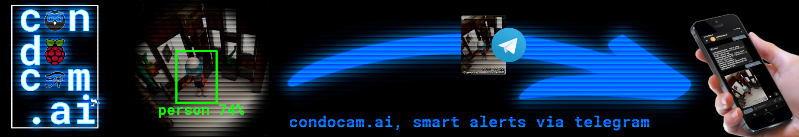
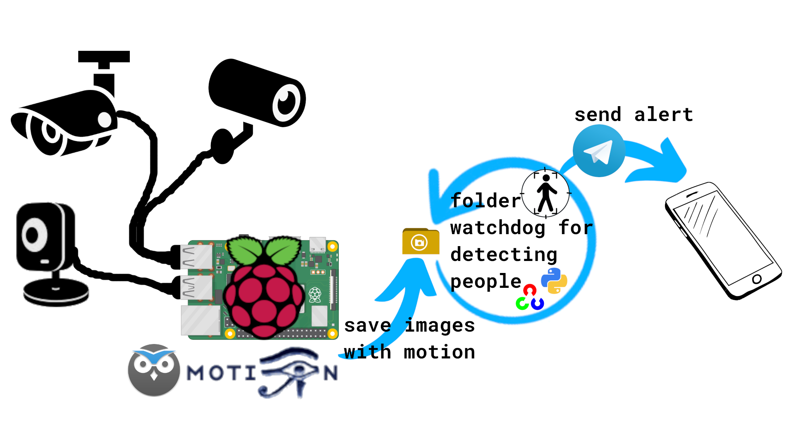

<sup>Code:</sup> [](https://github.com/beep-projects/condocam.ai/blob/main/LICENSE) [](https://github.com/beep-projects/condocam.ai/) [](https://github.com/beep-projects/condocam.ai/) [](https://github.com/beep-projects/condocam.ai/) [](https://github.com/beep-projects/condocam.ai/) [](https://github.com/beep-projects/condocam.ai/)  
<sup>Checks:</sup> [](https://github.com/beep-projects/condocam.ai/actions/workflows/shellcheck.yml) [](https://github.com/beep-projects/condocam.ai/actions/workflows/pylint.yml)  
<sup>Repo:</sup> [](https://github.com/beep-projects/SystaPi/issues) [](https://github.com/beep-projects/condocam.ai/network) [](https://github.com/beep-projects/condocam.ai/stargazers)  [](https://visitorbadge.io/status?path=beep-projects%2Fcondocam.ai)  

# condocam.ai

**condocam.ai** converts a Raspberry Pi with webcams into a **smart surveillance camera** with **people detection** and **automated alerts via Telegram**. The usage of people detection prevents false alarms caused by cats, dogs, light changes, etc. . (If you want, you can also make it to detect cats)

This project is based on the work from following other projects:

- [Motion](https://github.com/Motion-Project/motion) for simple motion detection, based on changed pixel between images
- [motionEye](https://github.com/ccrisan/motioneye) for simplified configutation of [Motion](https://github.com/Motion-Project/motion) and the attached cameras via a web interface
- [RaspAP](https://raspap.com/) for setting up a mobile hot spot on the **condocam.ai** (only set this up if you know how to secure a Raspberry Pi!)
- [OpenCV](https://opencv.org/) with a trained [MobileNetSSD](https://github.com/nikmart/pi-object-detection) model for [people detection](https://www.pyimagesearch.com/2017/10/16/raspberry-pi-deep-learning-object-detection-with-opencv/)
- [telegram.bot](https://github.com/beep-projects/telegram.bot) for sending messages via [Telegram](https://telegram.org/apps)
- [LiStaBot](https://github.com/beep-projects/LiStaBot) for providing system information and alerts if the sd card get's filled up

## Content

- [System Overview](#system-overview)
- [Project Requirements](#project-requirements)
- [Directory Structure](#directory-structure)
- [Installation](#installation)
  - [Setup a Telegram bot](#setup-a-telegram-bot)
  - [Installation on Linux](#installation-on-linux)
  - [Installation on Windows](#installation-on-windows)
- [Bot Commands](#bot-commands)

## <a name="system-overview"/>System Overview



## <a name="project-requirements"/>Project Requirements

The project will run on any **Raspberry Pi 3 or newer**. Originally it was designed to run on any Raspberry Pi, but unfortunately the support of OpenCV and Motion is limited for the ARMv6 architecture of older Raspberry Pis like Raspberry Pi Zero and Raspberry Pi 1 (see [Specifications](https://en.wikipedia.org/wiki/Raspberry_Pi#Specifications) for details). These models are not supported out of the box, but you can get the project running on these, if you compile `python-opencv` on your own. The people detection part requires the most CPU power and if you use earlier models, you will experience a bigger lag for the alerts via Telegram. The following describes the setups that I use with good results:

**Setup #1 "Surveillance Camera for my home"**
This setup features three cameras that overlook the important areas that intruders might pass on their way into my home.

- Raspberry Pi 4 Model B
- 64 GByte SD card
- 3 USB cameras:
  - GEMBIRD, UVC 1.00 device USB2.0 PC CAMERA (1908:2311)
  - Spedal C920 Pro Full HD webcam, UVC 1.00 device USB  Live camera (0c45:636b)
  - Logitech C525, UVC 1.00 device HD Webcam C525 (046d:0826)

**Setup #2 "Surveillance Camera for vacation homes"**
I use this setup for small mobile homes. One camera is enough to overlook the door. condocam.ai requires an internet connection for sending the telegram alerts, so I have added a LTE stick to it and added RaspAP as hot spot software to provide internet access for the whole family.

- Raspbery Pi 3 Model B+
- 32 GByte SD card
- Huawei Technologies Co., Ltd. E3372 LTE/UMTS/GSM HiLink Modem/Networkcard (12d1:14dc)
- 1 USB camera:
  - Chicony Electronics Co., Ltd HP Wide Vision HD Camera (04f2:b6b6)
  

**Note:** although the image detection should run on any Raspberry Pi model, you should go for a Raspberry Pi 4. The performance will vary heavily, as my quick and dirty measurements show for images of size 320x240 pixels.

| Model                           | typical processing time |
| ------------------------------- | ----------------------- |
| Raspberry Pi Model B+ v1.2      | 25-40s, avg. 29s        |
| Raspberry Pi 3 Model B+ Rev 1.3 | 1.6-3.1s, avg. 2.5s     |
| Raspberry Pi 4 Model B Rev 1.2  | 0.4-1.3s, avg. 0.58s    |


## <a name="directory-structure"/>Directory Structure

```
    ├── condocam-pi             # this folder holds all files that will be copied over to the Raspberry Pi
    │   ├── files               # all files which are required to run condocam.ai. These are all the configuration files
    │   │                       # for Motion and motionEye, as well as the files for the people detection and the communication
    │   │                       # via telegram
    │   ├── cmdline.txt         # file to be placed under /boot/cmdline.txt on the pi. Triggers the execution of firstrun.sh
    │   ├── firstrun.sh         # script for configuring Telegram bot, WiFi, keyboard and timezone. 
    │   │                       # You have to configure a few things in here!
    │   ├── secondrun.sh        # called by firstrun.sh after a reboot. Should have network running. 
    │   │                       # Does a full-upgrade of the system, sets up the communication via Telegram and
    │   │                       # installs required packages and services
    │   └── thirdrun.sh         # Cleans up after the installation and reboots into the final system
    ├── doc                     # documentation for this project
    │   └── resources          # resource files like images, used for the documentation of this project
    ├── install_condocam.ai.sh  # Script for automatically downloading, flashing and configuring 
    │                           # a Micro SD card for running condocam.ai
    ├── getAndConfigureCondocam.ai.sh  # Script for easy configuriation of install_condocam.ai.sh 
    ├── LICENSE                 # License for using and editing this software
    └── readme.md               # This file
```

## <a name="installation"/>Installation

If everything works fine, you can set up your **contocam.ai** in less than 1 hour. Main part is the automated installation of all required packages on the Raspberry Pi which runs for ~45 minutes.

#### <a name="setup-a-telegram-bot"/>Setup a Telegram bot

In order to use the messaging feature, you need a **Telegram** account and app. See the instructions for [telegram.bot](https://github.com/beep-projects/telegram.bot#usage) on how to set this up. After setting up the **Telegram bot** and obtaining your **API Token** (write it down, you will need it for installation), send `/start` to your bot. 
**Note:** If you do not continue with the installation within the next 24h you have to send the message to your bot again!  
**condocam.ai** will use the first received `/start` message to set the  administrator. So this might fail if you use a bot that was added to a group and other people are messaging there. You can change the configured administrator later by editing ```/etc/condocam/condocambotbot.conf``` on the device, but you have to figure out the needed IDs on your own.

#### <a name="installation-on-linux"/>Installation on Linux

For Linux I provide a script that downloads Raspberry Pi OS and flashes it onto a Micro SD card. The script was mainly written out of curiosity to see how that could work. So it has no added sanity checks and you should use it with care. Check each step, when asked to confirm. If unsure, follow the manual installation guide.

1. Run the following command in a shell for downloading the configuration script

   ```bash
   wget https://github.com/beep-projects/condocam.ai/releases/download/2.0/getAndConfigureCondocam.ai
   ```
2. Insert the Micro SD card that you want to get prepared as condocam.ai into your computer  

3. The next step will create a folder named `temp` in the current directory and clone this repo into it, which will delete any folder with the name `condocam.ai` in it. If you do not want that for some reason, edit the script before running.  
The script will ask you for hostname, username, passwort, Wifi credentials and bot token and run the `install_condocam.ai.sh` script configured with it.
Continue in the shell

   ```bash
   chmod 755 getAndConfigureCondocam.ai && ./getAndConfigureCondocam.ai
   ```
4. Follow the instruction in the shell  
5. Eject the Micro SD card and insert it into your Raspberry Pi

7. Power up the Raspberry Pi

8. Wait a while (~10-45 minutes, depending on the number of system updates available) 

   For troubleshooting, you can check the progress by checking the logs. After 5 minutes the resize of the partitions and ```firstrun.sh``` should be finished, so that you can ```ssh``` into the **condocam.ai** and watch the installation process

   ```bash
   ssh beep@condocam #or whatever name you used
   tail -f /boot/secondrun.log
   ```

9. **condocam.ai** will message you via the Telegram bot, once the installation is finished. You can then login to the motionEye web interface at a [http://condocam:8765](http://condocam:8765)

   ```
   user: admin
   pw: beep-projects
   ```

   - You should change the passwords for the admin and user accounts
   - For configuring motionEye, see [Configuration](https://github.com/ccrisan/motioneye/wiki/Configuration)
   - The cameras are preconfigured, but there are so many different camera models out there so you should adjust the default configuration to match your setup
   - If you selected to install RaspAP, check [RaspAP Basic Settings](https://docs.raspap.com/ap-basics/)

#### <a name="installation-on-windows"/>Installation on Windows
1. Install Raspberry Pi OS following this [guide](https://www.raspberrypi.org/documentation/installation/installing-images/).
   [Raspberry Pi OS Lite](https://www.raspberrypi.org/software/operating-systems/#raspberry-pi-os-32-bit) is sufficient.

2. Download [condocam.ai](https://github.com/beep-projects/condocam.ai/releases/download/1.0/condocam.ai-1.0.zip)

3. Extract the downloaded zip file

4. Change into the `condocam-pi` subfolder of the extracted archive

5. Open `firstrun.sh` with a text editor and configure everything in the marked section to your liking.

   Set the ```BOT_TOKEN``` to the **token** of your bot from the preparation  

   You also might want to use something like [WPA PSK (Raw Key) Generator](https://www.wireshark.org/tools/wpa-psk.html) and add the generated credentials to the file.

   ```bash
   #-------------------------------------------------------------------------------
   #----------------------- START OF CONFIGURATION --------------------------------
   #-------------------------------------------------------------------------------
   
   # copy here your API token obtained from @BotFather
   BOT_TOKEN=COPY_BOT_TOKEN_HERE
   # which hostname do you want to give your raspberry pi?
   HOSTNAME=condocam
   # username: beep, password: projects
   # you can change the password if you want and generate a new password with
   # Linux: mkpasswd --method=SHA-256
   # Windows: you can use an online generator like https://www.dcode.fr/crypt-hasing-function
   USERNAME=beep
   # shellcheck disable=SC2016
   PASSWD='$5$oLShbrSnGq$nrbeFyt99o2jOsBe1XRNqev5sWccQw8Uvyt8jK9mFR9' #keep single quote to avoid expansion of $
   # configure the wifi connection
   # the example WPA_PASSPHRASE is generated via
   #     wpa_passphrase MY_WIFI passphrase
   # but you also can enter your passphrase as plain text, if you accept the potential insecurity of that approach
   SSID=MY_WIFI
   WPA_PASSPHRASE=3755b1112a687d1d37973547f94d218e6673f99f73346967a6a11f4ce386e41e
   # configure your timezone and key board settings
   TIMEZONE="Europe/Berlin"
   COUNTRY="DE"
   XKBMODEL="pc105"
   XKBLAYOUT=$COUNTRY
   XKBVARIANT=""
   XKBOPTIONS=""
   # if you want to use an ENC28J60 Ethernet HAT, enable it here
   ENABLE_ENC28J60=false
   # if you want to setup RaspAP, so this device can be used as hot spot, enable it here
   # if you enable this feature, you need an Ethernet interface configured or another interfact with Internet connection!
   ENABLE_RASPAP=false
   
   #-------------------------------------------------------------------------------
   #------------------------ END OF CONFIGURATION ---------------------------------
   #-------------------------------------------------------------------------------
   ```

6. Make sure that the `boot`-partition of the Micro SD card is accessible via file explorer

7. Open `cmdline.txt` from the Micro SD card and copy the `root=PARTUUID=`-Number over into the `cmdline.txt` in the `condocam-pi` subfolder. If you do not do this step, your pi will not boot!

8. Copy all files and folders from the `condocam-pi` subfolder to `boot`-partition of the Micro SD card

9. Eject the Micro SD card and insert it into your Raspberry Pi

10. Power up the Raspberry Pi

11. Wait a while (~10-45 minutes, depending on the number of system updates available) 

    For troubleshooting, you can check the progress by checking the logs. After 5 minutes the resize of the partitions and ```firstrun.sh``` should be finished, so that you can ```ssh``` into the **condocam.ai** and watch the installation process

    ```bash
    ssh -x beep@condocam.local
    tail -f /boot/secondrun.log
    ```

    The password for the ```beep``` user is ```projects```,  if you did not change it during setup

12. The condocam.ai will message you once the installation is finished. You can then login to the motionEye web interface at a [http://condocam:8765](http://condocam:8765)

    ```
    user: admin
    pw: beep-projects
    ```

    - You should change the passwords for the admin and user accounts
    - For configuring motionEye, see [Configuration](https://github.com/ccrisan/motioneye/wiki/Configuration)
    - The cameras are preconfigured, but there so many different camera models out there so that you should adjust the default configuration to match your setup
    - If you selected to install RaspAP, check [RaspAP Basic Settings](https://docs.raspap.com/ap-basics/)

## <a name="bot-commands" />Bot commands

The script `condocambot.sh` is used for communication between you and your bot. During startup the following commands are registered at @BotFather

```
/mdon - enables motion detection on all cameras
/mdoff - disables motion detection on all cameras
/snapshot - gets snapshots from all cameras
/servicestatus - returns the status of the services
/systemstatus - returns the system status
/gcl - get CPU load Top 5
/gru - get RAM usage Top 5
/uptime - returns the results of the _uptime_ command on the bot server
/df - returns the result of _df -h_ on the bot server
/getconfig - get the content of listabot.conf
   Short /gconf
/restartme - restarts the motioneye.service
/restartbot - restarts the condocambot.service
/reboot - reboot the bot server
/shutdown - shut down the bot server
/help - shows this info
/setcommands - sends the commands list to @BotFather
```
In addition to the commands in the quick menu, there are more commands available. Commands with parameters cannot be added to the quick menu, so you have to enter them manually. To make your life easier, all commands have a three letter short code
```
/setdisklimit [VALUE] - set the alert threshold for disk usage to [VALUE] percent. Only integers allowed. 
   Short /sdl
/setcpulimit [VALUE] - set the alert threshold for cpu usage to [VALUE] percent. Only integers allowed.
   Short /scl
/setramlimit [VALUE] - set the alert threshold for ram usage to [VALUE] percent. Only integers allowed.
   Short /srl
/setcheckinterval [VALUE] - set the time interval in which the watchdog checks the limits to [VALUE] seconds.
   Short /sci
/getcpuloadtopx [VALUE1] [VALUE2]- get the [VALUE1] processes causing the highest CPU load. 
   If omitted, [VALUE1] defaults to 5. You can pass [VALUE2] to set the line width of the output.
   [VALUE2] defaults to 120.
   Short /gcl
/getramusagetopx [VALUE1] [VALUE2] - get the [VALUE1] processes having the highest RAM usage.
   If omitted, [VALUE1] defaults to 5. You can pass [VALUE2] to set the line width of the output.
   [VALUE2] defaults to 120.
   Short /gru
```
